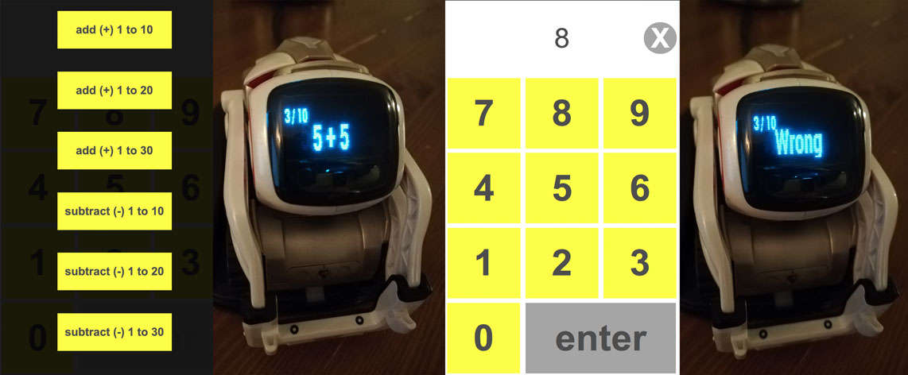

# Learn-math-with-Cozmo v0.1
Learning math interactively with the robot Cozmo from Anki
-

What does it do exactly?
-
After you pick a type of math to learn and a range, Cozmo offers a series of math questions that need to be answered on screen. This can be either the computer from which the program was started or a (mobile) device inside the local network.

This program offers a choice of match training sets (pic 1). Once a choice is made, Cozmo asks a number of questions (pic 2). The answer can be entered on screen (pic 3). Cozmo tells you it’s ok or not (pic 4). This repeats ten times with questions within the chosen range and math type, then ends with a celebration.

There is a similar script available for the other Anki robot, Vector: https://github.com/GrinningHermit/Learn-math-with-Vector

What do you need to use it?
-
1. Cozmo himself (http://anki.com/cozmo)
2. A computer
3. A little knowledge about Python
4. Knowledge of the Cozmo SDK (http://cozmosdk.anki.com/docs)
5. The files in this repository
6. The python module Pillow. (pip3 install --user Pillow, usually already installed when working with the Cozmo SDK)
7. The python module Flask. (pip3 install --user flask)

If you know how to run an example file from the Cozmo SDK, you should be able to run this script. 

System requirements
-
- Computer with Windows OS, mac OSX or Linux
- Python 3.6.1 or later
- WiFi connection
- (optional) Mobile device

Compatibility
-
- Cozmo SDK 1.*
 
Known issues
-
- Local network availability is dependent on a lot of factors not covered by this program or its explanation. It should work if you know the computer's local ip-address and enter that in the address bar of another device's browser at port 5000 (i.e. 192.168.x.x:5000).
